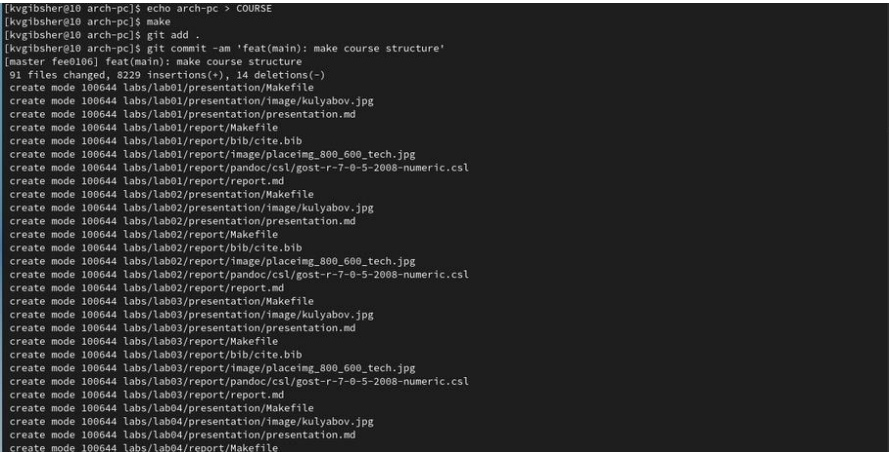

---
## Front matter
title: "Отчёт по лабораторной работе № 3"
subtitle: "Дисциплина: Архитектура Компьютера"
author: "Гибшер Кирилл Владимирович, НКАбд-01-22"

## Generic otions
lang: ru-RU
toc-title: "Содержание"

## Bibliography
bibliography: bib/cite.bib
csl: pandoc/csl/gost-r-7-0-5-2008-numeric.csl

## Pdf output format
toc: true # Table of contents
toc-depth: 2
lof: true # List of figures
lot: true # List of tables
fontsize: 12pt
linestretch: 1.5
papersize: a4
documentclass: scrreprt
## I18n polyglossia
polyglossia-lang:
name: russian
options:
- spelling=modern
- babelshorthands=true
polyglossia-otherlangs:
name: english
## I18n babel
babel-lang: russian
babel-otherlangs: english
## Fonts
mainfont: PT Serif
romanfont: PT Serif
sansfont: PT Sans
monofont: PT Mono
mainfontoptions: Ligatures=TeX
romanfontoptions: Ligatures=TeX
sansfontoptions: Ligatures=TeX,Scale=MatchLowercase
monofontoptions: Scale=MatchLowercase,Scale=0.9
## Biblatex
biblatex: true
biblio-style: "gost-numeric"
biblatexoptions:
- parentracker=true
- backend=biber
- hyperref=auto
- language=auto
- autolang=other*
- citestyle=gost-numeric
## Pandoc-crossref LaTeX customization
figureTitle: ""
tableTitle: "Таблица"
listingTitle: "Листинг"
lofTitle: "Список иллюстраций"
lotTitle: "Список таблиц"
lolTitle: "Листинги"
## Misc options
indent: true
header-includes:
- \usepackage{indentfirst}
- \usepackage{float} # keep figures where there are in the text
- \floatplacement{figure}{H} # keep figures where there are in the text
---

# Цель работы

Целью данной лабораторной работы является изучить идеологию и
применение средств контроля версий, а также приобретение
практических навыков по работе с системой git.

# Задание

1. Настроить учетную свою запись на сервере GitHub.
2. Провести базовую конфигурацию git в терминале Linux.
3. Создать SSH ключ для последующей идентификации пользователя на сервере репозиториев.
4. Просмотреть рабочее пространство и репозитория курса и на основе шаблона создать его, а также настроить его каталоги.
5. Сделать отчёт по третьей лабораторной в формате markdown.
6. Загрузил файлы на github.

# Теоретическое введение
Системы контроля версий (Version Control System, VCS) применяются
при работе нескольких человек над одним проектом. Обычно основное
дерево проекта хранится в локальном или удалённом репозитории, к
которому настроен доступ для участников проекта. При внесении
изменений в содержание проекта система контроля версий позволяет
их фиксировать, совмещать изменения, произведённые разными
участниками проекта, производить откат к любой более ранней версии
проекта, если это требуется.
Системы контроля версий поддерживают возможность отслеживания и
разрешения конфликтов, которые могут возникнуть при работе
нескольких человек над одним файлом. Можно объединить (слить)
изменения, сделанные разными участниками (автоматически или
вручную), вручную выбрать нужную версию, отменить изменения
вовсе или заблокировать файлы для изменения. В зависимости от
настроек блокировка не позволяет другим пользователям получить
рабочую копию или препятствует изменению рабочей копии файла
средствами файловой системы ОС, обеспечивая таким образом,
привилегированный доступ только одному пользователю,
работающему с файлом. Системы контроля версий также могут
обеспечивать дополнительные, более гибкие функциональные
возможности. Например, они могут поддерживать работу с
несколькими версиями одного файла, сохраняя общую историю
изменений до точки ветвления версий и собственные истории
изменений каждой ветви.
В отличие от классических, в распределённых системах контроля
версий центральный репозиторий не является обязательным. Среди
классических VCS наиболее известны CVS, Subversion, а среди
распределённых — Git, Bazaar, Mercurial. Принципы их работы схожи,
отличаются они в основном синтаксисом используемых в работе
команд.

Система контроля версий Git представляет собой набор программ командной
строки. Доступ к ним можно получить из терминала посредством ввода
команды git с различными опциями.Благодаря тому, что Git является распределённой системой контроля версий,
резервную копию локального хранилища можно сделать простым
копированием или архивацией.
Наиболее часто используемые команды git представлены на рисунке ниже. (рис. [-@fig:001])

![Рис.1] (image/1.jpg)  {#fig:001 width=70% }

Работа пользователя со своей веткой начинается с проверки и получения
изменений из центрального репозитория (при этом в локальное дерево до
начала этой процедуры не должно было вноситься изменений):
git checkout master
git pull
git checkout -b имя_ветки
Затем можно вносить изменения в локальном дереве и/или ветке. После
завершения внесения какого-то изменения в файлы и/или каталоги проекта
необходимо разместить их в центральном репозитории. Для этого
необходимо проверить, какие файлы изменились к текущему моменту:
git status
и при необходимости удаляем лишние файлы, которые не хотим отправлять в
центральный репозиторий. Затем полезно просмотреть текст изменений на
предмет соответствия правилам ведения чистых коммитов:
git diff
Если какие-либо файлы не должны попасть в коммит, то помечаем только те
файлы, изменения которых нужно сохранить. Для этого используем команды
добавления и/или удаления с нужными опциями:
git add имена_файлов
git rm имена_файлов
Если нужно сохранить все изменения в текущем каталоге, то используем:
git add
Затем сохраняем изменения, поясняя, что было сделано:
git commit -am "Some commit message"
и отправляем в центральный репозиторий:
git push origin имя_ветки / git push

# Выполнение лабораторной работы

1. Для начала лабораторной работы необходимо создать учетную запись на GitHub и заполнить основные данные (рис. [-@fig:002], [-@fig:003]). 

 { #fig:002 width=70% }

 { #fig:003 width=70% }

2. Далее сделаем предварительную конфигурацию git. Открываем терминал и вводим следующие команды , указав свой email и имя владельца репозитория. Также настроим utf-8 в выводе сообщений git.Также зададим имя начальной ветки(назвав ее master) и настроим параметры autocrlf и safecrfl. (рис. [-@fig:004] ).

 { #fig:004 width=70% }

3. Далее для последующей идентификации на сервере репозиториев нам нужно сгенерировать пару ключей ( приватный и открытый). Ключи сохраняться в каталоге ~/.ssh/. (рис. [-@fig:005] ).

 { #fig:005 width=70% }

4. Далее необходимо загрузить сгенерированный открытый ключ. Для этого мы переходим под свою учетную запись на сайте github.ru , перейти в меню , затем в настройки , после этого выбрать в боковом меню SSH and GPG Keys и нажать New SSH Key (рис. [-@fig:006] ).

{ #fig:006 width=70% }

5. Далее нам необходимо скопировать из локальной консоли сгенерированный ключ в буфер обмена для последующий вставки в нужную графу на сайте. Делаем это с помощью соответствующей команды cat и xclip -sel . (рис. [-@fig:007] ).

{ #fig:007 width=70% }

6. Затем вставляем ключ в появившееся на сайте поле и указываем для ключа имя ,в данном случае я назвал его «SSH Key» (рис. [-@fig:008]).

{ #fig:008 width=70% }

7. Далее нам необходимо создать рабочее пространство. Для этого создаем каталог для предмета «Архитектура компьютера» (рис. [-@fig:009]).

{ #fig:009 width=70% }

8. Затем переходим на страницу репозитория с шаблоном курса , по указанной ссылке и выбираем «Use this template» (рис. [-@fig:010]).

{ #fig:010 width=70% }

9. В открывшемся окне задаем имя репозитория «study_2022-2023_arh-pc и нажимаем на кнопку для создания репозитория. (рис. [-@fig:011]).

{ #fig:011 width=70% }

10. Далее возвращаемся в терминал и открываем каталог курса. Клонируем созданный репозиторий, с помощью соответствующей команды. Ссылку для клонирования можно скопировать с сайта на странице созданного репозитория Code - SSH. (рис. [-@fig:012]).

{ #fig:012 width=70% }

11. Создаем необходимые каталоги и отправляем файлы на сервер. (рис. [-@fig:013]).

{ #fig:013 width=70% }

12. Проверяем правильность создания иерархии рабочего пространства в на странице github. (рис. [-@fig:014],[-@fig:015] ).

{ #fig:014 width=70% }

{ #fig:015 width=70% }

13. Создадим отчет по выполнению лабораторной работы в соответствующем каталоге рабочего пространства. (рис. [-@fig:016]).

{ #fig:016 width=70% }

14. Скопируем отчеты по выполнению предыдущих лабораторных работ в соответствующие каталоги созданного рабочего пространства.Таким образом все необходимые файлы были загружены на GitHub (рис. [-@fig:017]
[-@fig:018] ).

{ #fig:017 width=70% }

{ #fig:018 width=70% }

# Выводы

Как итог выполнения данной лабораторной работы я создал собственную
учетную запись на пространстве GitHub,который пригодится для выполнения
следующих работ и прогресса по курсу «Архитектура ЭВМ». Также изучил
идеологию и применение средств контроля версий. Приобрел практические
навыки по работе с системой git в терминале, самостоятельно создал SSH
ключ и понял структуру пространства ,в котором необходимо будет работать
по мере прохождения курса.

# Список литературы{.unnumbered}

[1. Текстовый файл «Лабораторная работа №3. Система контроля версий Git](https://esystem.rudn.ru/pluginfile.php/1584622/mod_resource/content/1/Лабораторная%20работа%20№3.pdf)

::: {#refs}
:::
