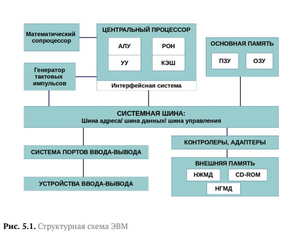
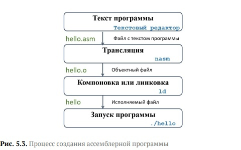
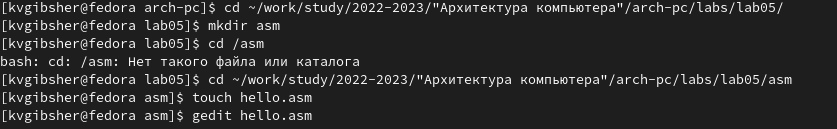
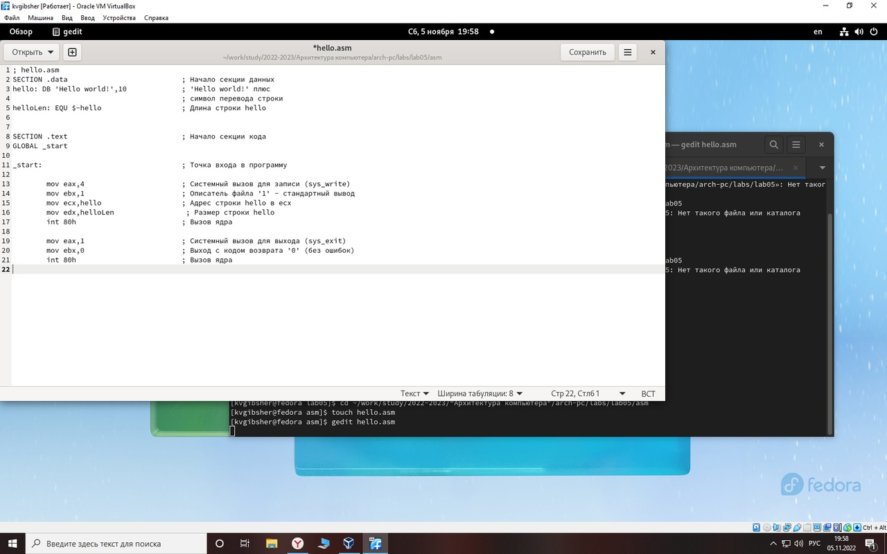
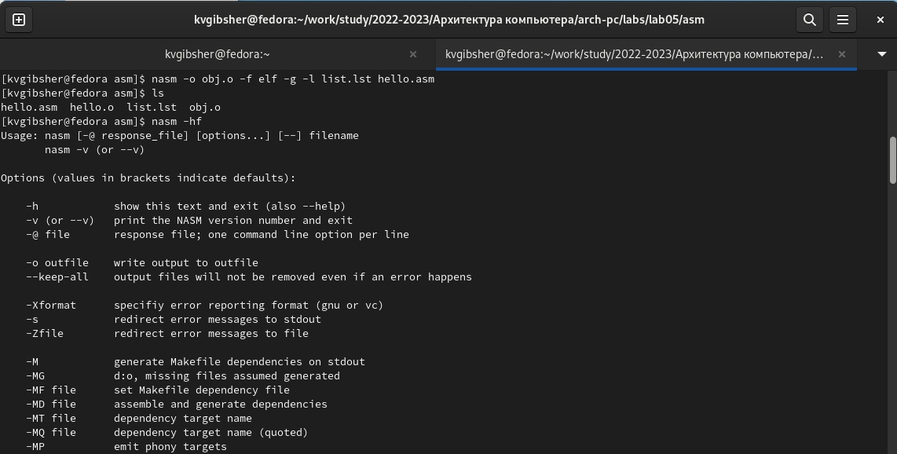
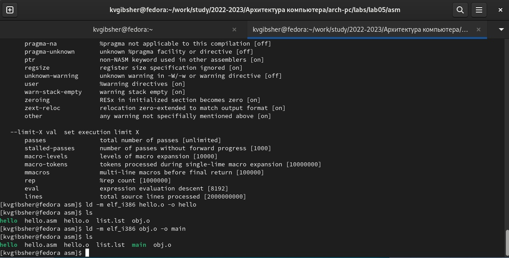
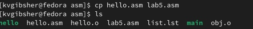
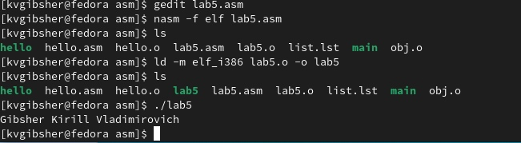
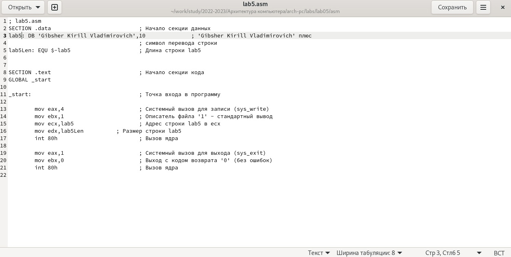
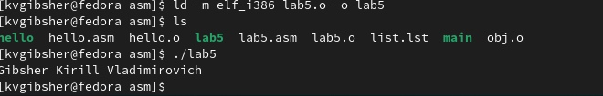

---
## Front matter
title: "Отчёт по лабораторной работе № 5"
subtitle: "Дисциплина: Архитектура Компьютера"
author: "Гибшер Кирилл Владимирович, НКАбд-01-22"

## Generic otions
lang: ru-RU
toc-title: "Содержание"

## Bibliography
bibliography: bib/cite.bib
csl: pandoc/csl/gost-r-7-0-5-2008-numeric.csl

## Pdf output format
toc: true # Table of contents
toc-depth: 2
lof: true # List of figures
lot: true # List of tables
fontsize: 12pt
linestretch: 1.5
papersize: a4
documentclass: scrreprt
## I18n polyglossia
polyglossia-lang:
name: russian
options:
- spelling=modern
- babelshorthands=true
polyglossia-otherlangs:
name: english
## I18n babel
babel-lang: russian
babel-otherlangs: english
## Fonts
mainfont: PT Serif
romanfont: PT Serif
sansfont: PT Sans
monofont: PT Mono
mainfontoptions: Ligatures=TeX
romanfontoptions: Ligatures=TeX
sansfontoptions: Ligatures=TeX,Scale=MatchLowercase
monofontoptions: Scale=MatchLowercase,Scale=0.9
## Biblatex
biblatex: true
biblio-style: "gost-numeric"
biblatexoptions:
- parentracker=true
- backend=biber
- hyperref=auto
- language=auto
- autolang=other*
- citestyle=gost-numeric
## Pandoc-crossref LaTeX customization
figureTitle: ""
tableTitle: "Таблица"
listingTitle: "Листинг"
lofTitle: "Список иллюстраций"
lotTitle: "Список таблиц"
lolTitle: "Листинги"
## Misc options
indent: true
header-includes:
- \usepackage{indentfirst}
- \usepackage{float} # keep figures where there are in the text
- \floatplacement{figure}{H} # keep figures where there are in the text
---

# Цель работы

Целью работы является освоение процедуры компиляции и сборки программ, написанных на ассемблере NASM.

# Задание

1. Рассмотреть самый простой пример программы на языке ассемблера NASM. Hello world!
2. Изучить способности транслятора NASM.
3. Скомпилировать файл формата .asm 
4. Скомпоновать данный файл и запустить.
5. Провести самостоятельную работу согласно задачам из лаб.работы

# Теоретическое введение

## Основные принципы работы компьютера
Основными функциональными элементами любой электронно-вычислительной машины (ЭВМ) являются центральный процессор, память и периферийные устройства (рис. 5.1).
Взаимодействие этих устройств осуществляется через общую шину, к которой они подключены. Физически шина представляет собой большое количество проводников, соединяющих устройства друг с другом. В современных компьютерах проводники выполнены в виде электропроводящих дорожек на материнской  плате.
Структурная схема ЭВМ. (рис. [-@fig:001])

{ #fig:001 width=70% }

Основной задачей процессора является обработка информации, а также организация координации всех узлов компьютера. В состав **центрального процессора** (ЦП) входят следующие устройства:

1. **арифметико-логическое устройство** — выполняет логические и арифметические действия, необходимые для обработки информации,хранящейся в памяти;
2. **устройство управления** — обеспечивает управление и контроль всех устройств компьютера;
3. **регистры** — сверхбыстрая оперативная память небольшого объёма, входящая в состав процессора, для временного хранения промежуточных результатов выполнения инструкций; регистры процессора делятся на два типа: *регистры общего назначения* и *специальные регистры*.
Для того, чтобы писать программы на ассемблере, необходимо знать, какие регистры процессора существуют и как их можно использовать. Большинство команд в программах написанных на ассемблере используют регистры в качестве операндов. Практически все команды представляют собой преобразование данных хранящихся в регистрах процессора, это например пересылка данных между регистрами или между регистрами и памятью, преобразование (арифметические или логические операции) данных хранящихся в регистрах.
Доступ к регистрам осуществляется не по адресам, как к основной памяти, а по именам. Каждый регистр процессора архитектуры x86 имеет свое название, состоящее из 2 или 3 букв латинского алфавита. В качестве примера приведем названия основных регистров общего назначения (именно эти регистры чаще всего используются при написании программ):

1. RAX, RCX, RDX, RBX, RSI, RDI — 64-битные
2. EAX, ECX, EDX, EBX, ESI, EDI — 32-битные
3. AX, CX, DX, BX, SI, DI — 16-битные
4. AH, AL, CH, CL, DH, DL, BH, BL — 8-битные

Таким образом можно отметить, что вы можете написать в своей программе, например, такие команды (mov – команда пересылки данных на языке ассемблера):
 mov   ax, 1
 mov   eax, 1 
 
 Другим важным узлом ЭВМ является **оперативное запоминающее устройство** . ОЗУ — это быстродействующее энергозависимое запоминающее устройство, которое напрямую взаимодействует с узлами процессора, предназначенное для хранения программ и данных, с которыми процессор непосредственно работает в текущий момент. ОЗУ состоит из одинаковых пронумерованных ячеек памяти. Номер ячейки памяти — это адрес хранящихся в нейданных.
 
 В состав ЭВМ также входят **периферийные устройства**, которые можно разделить на:
 
 1. *устройства внешней памяти*, которые предназначены для долговременного хранения больших объёмов данных (жёсткие диски, твердотельные накопители, магнитные ленты);
 2.  *устройства ввода-вывода*, которые обеспечивают взаимодействие ЦП с внешней средой.
 
###  Ассемблер и язык ассемблера

Язык ассемблера (assembly language, сокращённо asm) — машинноориентированный язык низкого уровня. Можно считать, что он больше любых других языков приближен к архитектуре ЭВМ и её аппаратным возможностям, что позволяет получить к ним более полный доступ, нежели в языках высокого уровня, таких как C/C++, Perl, Python и пр. Заметим, что получить полный доступ к ресурсам компьютера в современных архитектурах нельзя, самым низким уровнем работы прикладной программы является обращение напрямую к ядру ОС.

Наиболее распространёнными ассемблерами для архитектуры x86 являются: 

1.  для DOS/Windows: Borland Turbo Assembler (TASM), Microsoft Macro Assembler (MASM) и Watcom assembler (WASM);
2. для GNU/Linux: gas (GNU Assembler), использующий AT&T-синтаксис, в отличие от большинства других популярных ассемблеров, которые используют Intel-синтаксис.

**NASM** — это открытый проект ассемблера, версии которого доступны под различные операционные системы и который позволяет получать объектные файлы для этих систем. В NASM используется Intel-синтаксис и поддерживаются инструкции x86-64.

####  Процесс создания и обработки программы на языке ассемблера

Процесс создания ассемблерной программы можно изобразить в виде следующей схемы (рис. [-@fig:002]) 

{ #fig:002 width=70% }

В процессе создания ассемблерной программы можно выделить четыре шага: 

1.  **Набор текста** программы в текстовом редакторе и сохранение её в отдельном файле. Каждый файл имеет свой тип (или расширение), который определяет назначение файла. Файлы с исходным текстом программ на языке ассемблера имеют тип asm.
2. **Трансляция** — преобразование с помощью транслятора, например nasm, текста программы в машинный код, называемый объектным. На данном этапе также может быть получен листинг программы, содержащий кроме текста программы различную дополнительную информацию, созданную транслятором. Тип объектного файла — o, файла листинга — lst
3.  **Компоновка или линковка** — этап обработки объектного кода компоновщиком (ld), который принимает на вход объектные файлы и собирает по ним исполняемый файл. Исполняемый файл обычно не имеет расширения. Кроме того, можно получить файл карты загрузки программы в ОЗУ, имеющий расширение map.
4. **Запуск программы**. Конечной целью является работоспособный исполняемый файл. Ошибки на предыдущих этапах могут привести к некорректной работе программы, поэтому может присутствовать этап отладки программы при помощи специальной программы — отладчика. При нахождении ошибки необходимо провести коррекцию программы, начиная с первого шага.

# Выполнение лабораторной работы
1. Создадим каталог для работы с программами на языке ассемблера NASM  и назовем его "asm". Затем перейдя в данный каталог, создадим текстовый файл с названием hello.asm и откроем его с помощью текстового редактора gedit.  (рис. [-@fig:003])

{ #fig:003 width=70% }

2. Открыв  hello.asm в gedit введем туда указанный в лабораторной работе текст,соблюдая синтаксис ассемблера NASM. (рис. [-@fig:004]) 

{ #fig:004 width=70% }

3. Далее скомпилируем текст программы "Hello World" , написав терминальную команду указанную на скриншоте. Таким образом, текст программы преобразован в объектный код, который записался в файл hello.o . С помощью команды ls проверим , что объектный файл действительно создан. (рис. [-@fig:005])

{ #fig:005 width=70% }

4. Далее применим команду , которая скомпилирует исходный файл hello.asm в obj.o (опция -o позволяет задать имя объектного файла, в данном случае obj.o), при этом формат выходного файла будет elf, и в него будут включены символы для отладки (опция -g), кроме того, будет создан файл листинга list.lst (опция -l) и с помощью команды ls проверим, что все файлы успешно созданы. Для получения списка форматов объектного файла пропишем  nasm -hf.  (рис.[-@fig:006]) 

{ #fig:006 width=70% }

5. Затем, чтобы получить исполняемую программу необходимо объектный файл передать на обработку компоновщику с помощью необходимой команды. С помощью ls проверим, что исполняемый файл **hello** был создан. Затем преобразуем объектный файл obj.o в исполняемый , изменив его имя на main. Таким образом исполняемый файл имеет имя - main , а имя объектного файла , из которого он был создан - obj.o . (рис.[-@fig:007]) 

{ #fig:007 width=70% }

6. И в завершении основной части лабораторной работы запустим на выполнение созданный исполняемый файл, находящийся в
текущем каталоге , набрав в командной строке : "./hello". (рис.[-@fig:008]) 

{ #fig:008 width=70% }

7. Приступим к заданиям для самостоятельной работы. И начнем с того, что в каталоге ~/work/arch-pc/lab05 с помощью команды cp создадим копию
файла hello.asm с именем lab5.asm. (рис.[-@fig:009]) 

{ #fig:009 width=70% }

8. Затем с помощью  текстового редактора gedit внесем необходимые изменения в текст программы в файле lab5.asm так, чтобы вместо Hello world! на экран выводилась строка с моим ФИО. Сразу проведем необходимые преобразования объектных файлов в исполняемые, проверив все командой ls и запустим на выполнение созданный исполняемый файл. Задача успешно выполнена - выводится мое ФИО. (рис.[-@fig:010]) 

{ #fig:010 width=70% }

9. Оттранслируем полученный текст программы lab5.asm в объектный файл. Выполним компоновку объектного файла и запустим получившийся исполняемый файл. (рис.[-@fig:011]) 

{ #fig:011 width=70% }

10. Скопируем файлы hello.asm и lab5.asm в  локальный репозиторий в каталог ~/work/study/2022-2023/"Архитектура компьютера"/archpc/labs/lab05/. Загрузим файлы на Github и создадим отчет о проделанной работе. (рис.[-@fig:012]) 

{ #fig:012 width=70% }

# Выводы

В ходе данной работы я освоил процедуры компиляции и сборки программ, написанных на ассемблере NASM.

# Список литературы{.unnumbered}

[1. Текстовый файл «Лабораторная работа №5. Создание и процесс обработки программ на языке ассемблера NASM](https://esystem.rudn.ru/pluginfile.php/1584628/mod_resource/content/1/Лабораторная%20работа%20№5.pdf)

::: {#refs}
:::
