---
## Front matter
title: "Лабораторная работа №6"
subtitle: "Дисциплина: Архитектура компьютера"
author: "Гибшер Кирилл Владимирович"

## Generic otions
lang: ru-RU
toc-title: "Содержание"

## Bibliography
bibliography: bib/cite.bib
csl: pandoc/csl/gost-r-7-0-5-2008-numeric.csl

## Pdf output format
toc: true # Table of contents
toc-depth: 2
lof: true # List of figures
lot: true # List of tables
fontsize: 12pt
linestretch: 1.5
papersize: a4
documentclass: scrreprt
## I18n polyglossia
polyglossia-lang:
  name: russian
  options:
	- spelling=modern
	- babelshorthands=true
polyglossia-otherlangs:
  name: english
## I18n babel
babel-lang: russian
babel-otherlangs: english
## Fonts
mainfont: PT Serif
romanfont: PT Serif
sansfont: PT Sans
monofont: PT Mono
mainfontoptions: Ligatures=TeX
romanfontoptions: Ligatures=TeX
sansfontoptions: Ligatures=TeX,Scale=MatchLowercase
monofontoptions: Scale=MatchLowercase,Scale=0.9
## Biblatex
biblatex: true
biblio-style: "gost-numeric"
biblatexoptions:
  - parentracker=true
  - backend=biber
  - hyperref=auto
  - language=auto
  - autolang=other*
  - citestyle=gost-numeric
## Pandoc-crossref LaTeX customization
figureTitle: "Рис."
tableTitle: "Таблица"
listingTitle: "Листинг"
lofTitle: "Список иллюстраций"
lotTitle: "Список таблиц"
lolTitle: "Листинги"
## Misc options
indent: true
header-includes:
  - \usepackage{indentfirst}
  - \usepackage{float} # keep figures where there are in the text
  - \floatplacement{figure}{H} # keep figures where there are in the text
---

# Цель работы

Приобретение практических навыков работы в Midnight Commander. Освоение
инструкций языка ассемблера mov и int.

# Задание

1.	Основы работы с mc
2.	Структура программы на языке ассемблера NASM
3.	Подключение внешнего файла
4.	Выполнение заданий для самостоятельной работы

# Теоретическое введение

Midnight Commander (или просто mc) — это программа, которая позволяет просматривать структуру каталогов и выполнять основные операции по управлению файловой системой, т.е. mc является файловым менеджером. Midnight Commander позволяет сделать работу с файлами более удобной и наглядной. Программа на языке ассемблера NASM, как правило, состоит из трёх секций: секция кода программы (SECTION .text), секция инициированных (известных во время компиляции) данных (SECTION .data) и секция неинициализированных данных (тех, под которые во время компиляции только отводится память, а значение присваивается в ходе выполнения программы) (SECTION .bss). Для объявления инициированных данных в секции .data используются директивы DB, DW, DD, DQ и DT, которые резервируют память и указывают, какие значения должны храниться в этой памяти: - DB (define byte) — определяет переменную размером в 1 байт; - DW (define word) — определяет переменную размеров в 2 байта (слово); - DD (define double word) — определяет переменную размером в 4 байта (двойное слово); - DQ (define quad word) — определяет переменную размером в 8 байт (учетве- рённое слово); - DT (define ten bytes) — определяет переменную размером в 10 байт. Директивы используются для объявления простых переменных и для объявления массивов. Для определения строк принято использовать директиву DB в связи с особенностями хранения данных в оперативной памяти. Инструкция языка ассемблера mov предназначена для дублирования данных источника в приёмнике.

# Выполнение лабораторной работы

1. Открываю Midnight Commander, введя в терминал mc (рис. [-@fig:001])

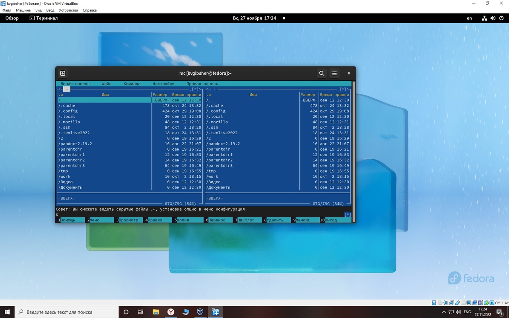{ #fig:001 width=70% }

2. Создаю каталог lab06_nasm (рис. [-@fig:002])

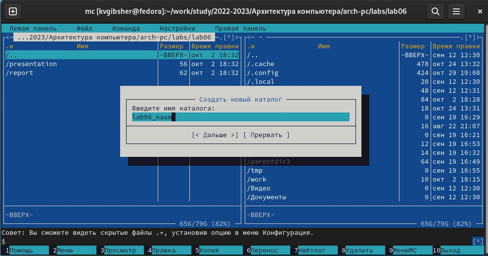{ #fig:002 width=70% }

3. С помощью команды touch lab6-1.asm создаю файл, в котором буду работать. С помощью функциональной клавиши F4 открываю созданный файл для редактирования. Ввожу в файл код программы для запроса строки у пользователя (рис. [-@fig:003])

{ #fig:003 width=70% }

4. Транслирую текст программы файла в объектный файл командой nasm -f elf lab6-1.asm, получаю объектный файл lab6-1.o, далее выполняю компоновку объектного файла с помощью команды ld -m elf_i386 -o lab6-1 lab6-1.o, получаю исполняемый файл lab6-1  и запускаю исполняемый файл, программа просит ввести строку, ввожу имя и фамилию (рис. [-@fig:004])

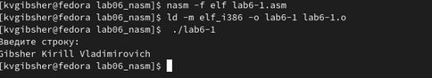{ #fig:004 width=70% }

5. Скачиваю файл in_out.asm со страницы курса в ТУИС. С помощью функциональной клавиши F5 копирую файл in_out.asm из каталога загрузки в созданный каталог lab06_nasm (рис. [-@fig:005]) 

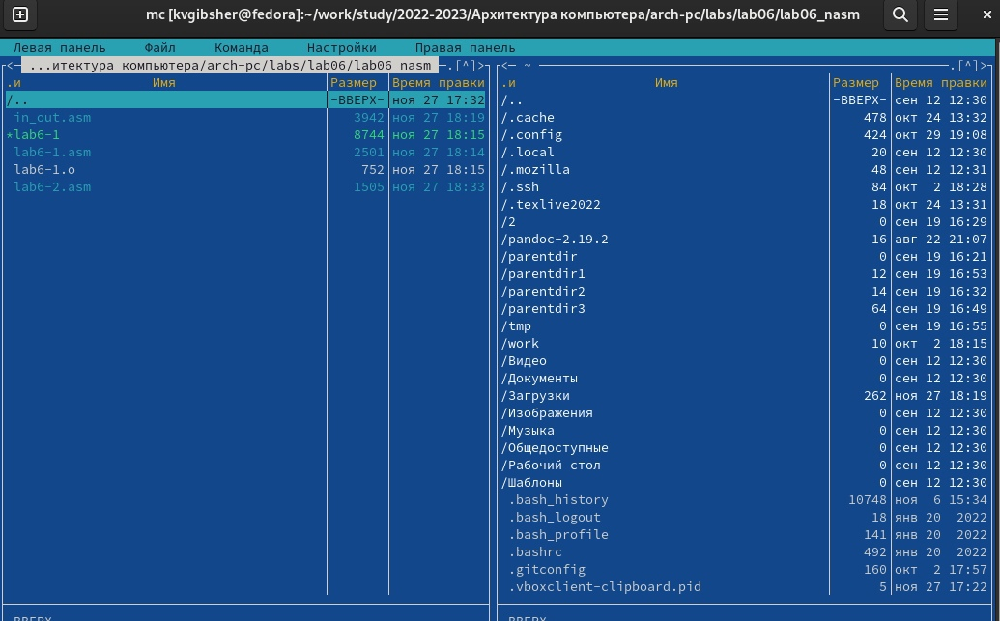{ #fig:005 width=70% }

6. С помощью функциональной клавиши F6 создаю копию файла lab6-1.asm с именем lab6-2.asm. Исправляю текст программы в файле lab6-2.asm с использование подпрограмм из внешнего файла in_out.asm (использую подпрограммы sprintLF, sread и quit) (рис. [-@fig:006])

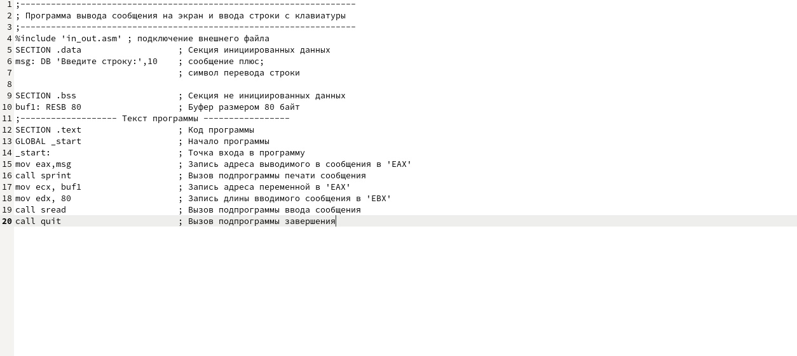{ #fig:006 width=70% }

7. Транслирую текст программы файла в объектный файл командой nasm -f elf lab6-2.asm, получаю объектный файл lab6-2.o, далее выполняю компоновку объектного файла с помощью команды ld -m elf_i386 -o lab6-2 lab6-2.o, получаю исполняемый файл lab6-2 (рис. [-@fig:007])

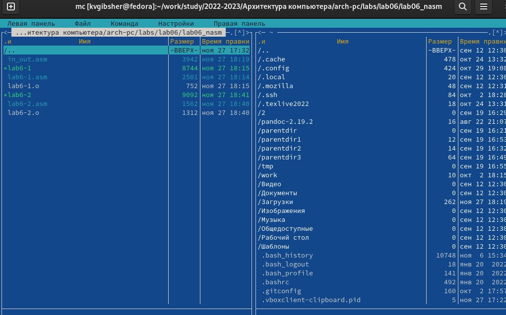{ #fig:007 width=70% }

8. Запускаю исполняемый файл, программа просит ввести строку, ввожу имя и фамилию (рис. [-@fig:008])

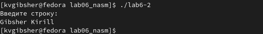{ #fig:008 width=70% }

9. Начинаю выполнять задания для самостоятельной работы. Создаю копию файла lab6-1.asm с именем lab6-1-1.asm с помощью функциональной клавиши F5 (рис. [-@fig:009]) 

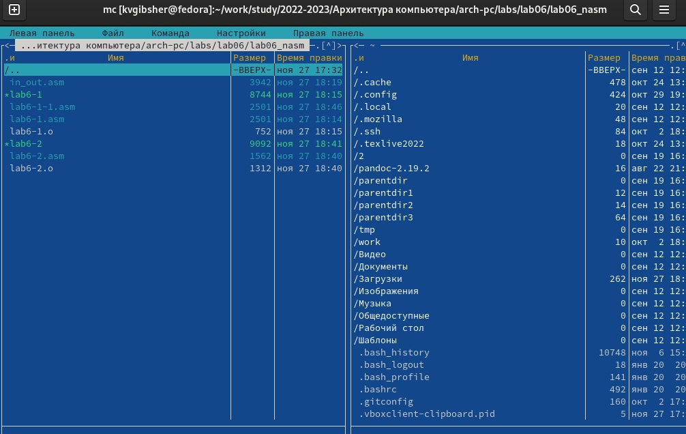{ #fig:009 width=70% }

10. С помощью функциональной клавиши F4 открываю созданный файл и изменяю программу так, чтобы кроме вывода приглашения и запроса ввода, она выводила вводимую пользователем строку (рис. [-@fig:010])

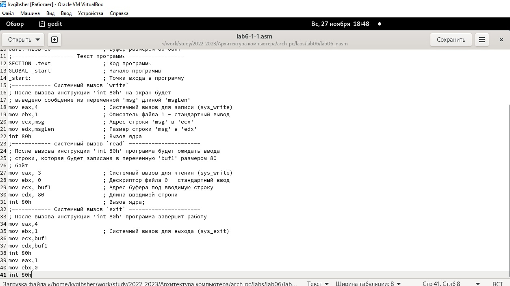{ #fig:010 width=70% }

11. Транслирую текст программы файла в объектный файл командой nasm -f elf lab6-1-1.asm, получаю объектный файл lab6-1-1.o, далее выполняю компоновку объектного файла с помощью команды ld -m elf_i386 -o lab6-1-1 lab6-1-1.o, получаю исполняемый файл lab6-1-1. Программа просит ввести строку, ввожу свои ФИО, далее программа выводит введенные данные (рис. [-@fig:011])

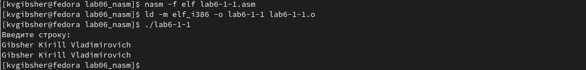{ #fig:011 width=70% }

12. Создаю копию файла lab6-2.asm с именем lab6-2-1.asm с помощью функциональной клавиши F5 (рис. [-@fig:012]) 

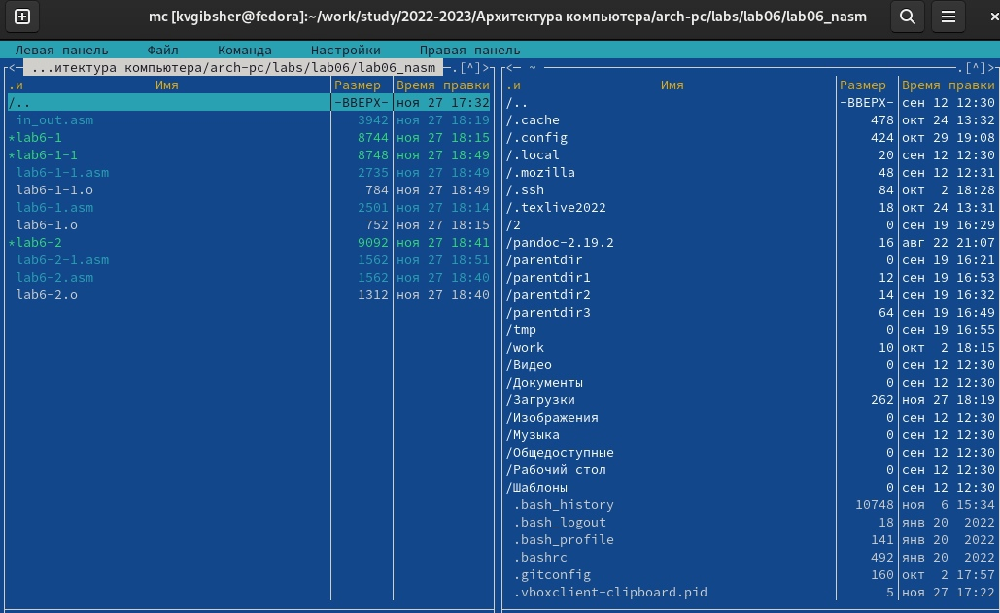{ #fig:012 width=70% }

13. С помощью функциональной клавиши F4 открываю созданный файл и изменяю программу так, чтобы кроме вывода приглашения и запроса ввода, она выводила вводимую пользователем строку и запускаю программу протранслировав текст программы файла в объектный файл соответствующими командами , получаю объектный файл и далее выполняю компоновку объектного файла, после чего запускаю исполняемый файл. (рис. [-@fig:013])

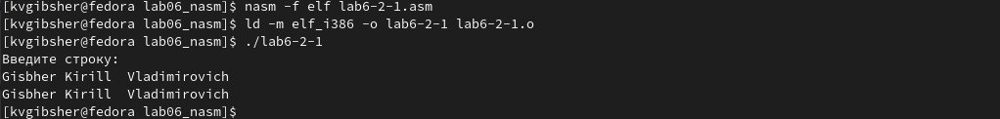{ #fig:013 width=70% }

# Выводы

Я приобрел практические навыки работы в Midnight Commander, а также освоил
инструкции языка ассемблера mov и int.

# Список литературы{.unnumbered}

::: {#refs}
:::
